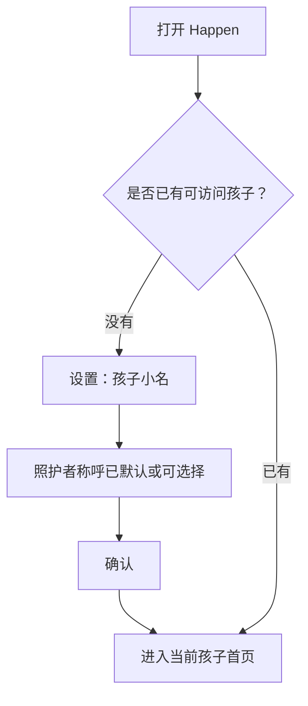
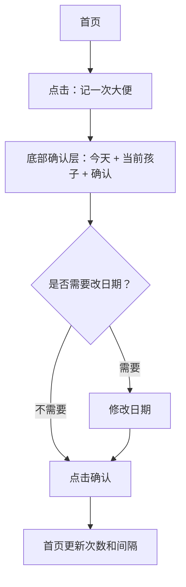
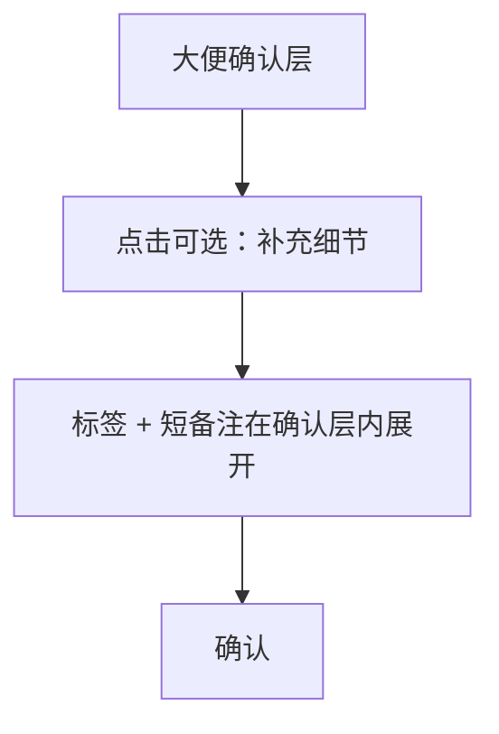
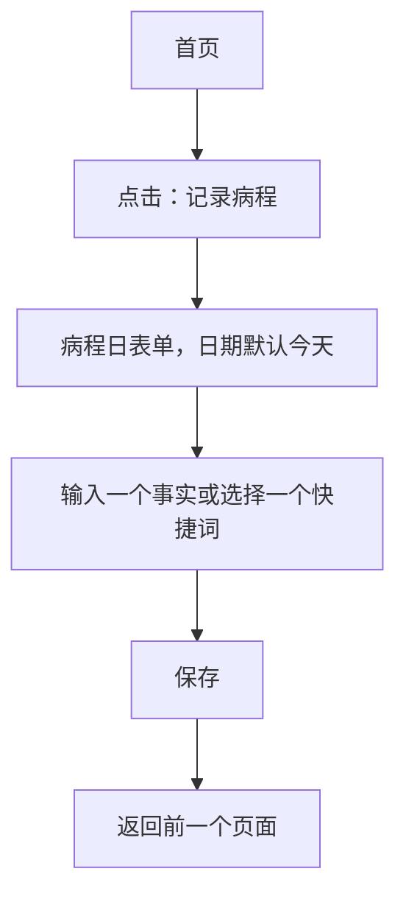
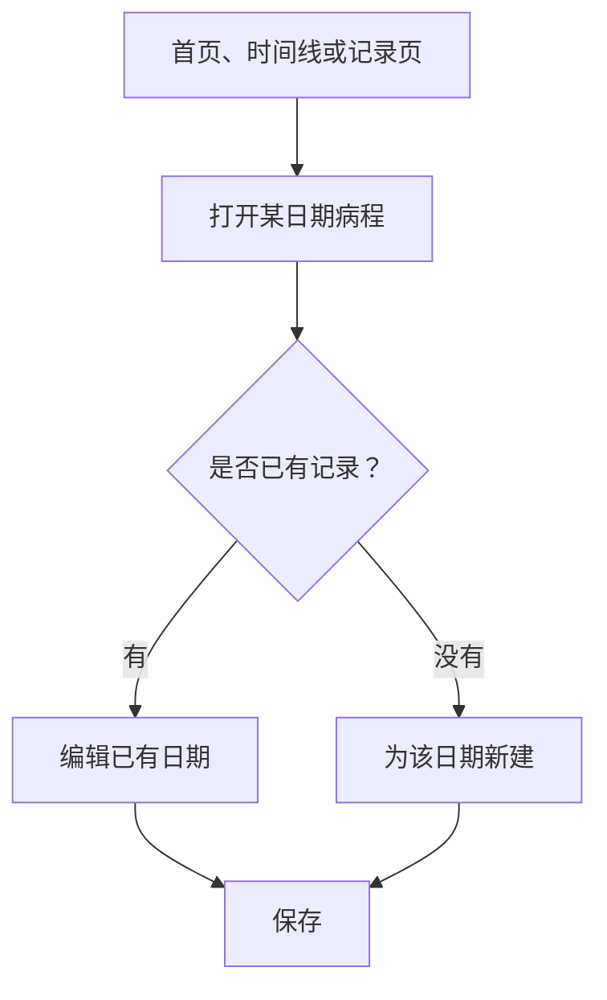
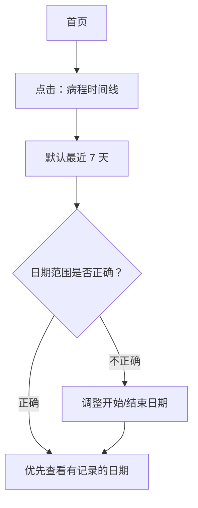
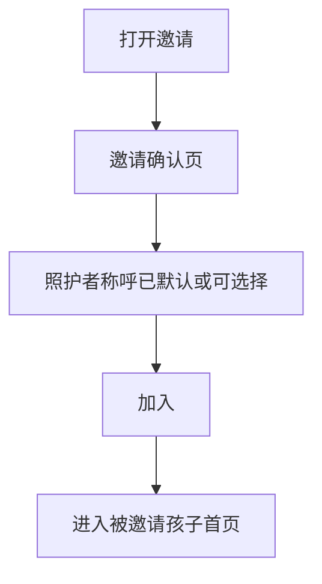

# Happen 体验原型

本文定义 Happen MVP 的用户体验结构。它不是视觉设计说明，不定义颜色、品牌、字体、插画或精细 UI 风格。

本版本围绕一个原则优化：

> 照护者打开 Happen，主要是为了记录已经发生的事情。

核心交互目标是：

> 首页出现后，记录一次大便应只需要两次点击。记录一天病程应能只输入一个快捷事实并保存。

MVP 应该像一个以孩子为范围的快速记录工作台，而不是记录管理应用。

## 1. 信息架构

### 导航模型

Happen 应该首页优先。

推荐 MVP 结构：

1. `首页`
   - 当前孩子上下文。
   - 大便状态。
   - 两个快速记录操作。
   - 病程时间线入口。
   - 轻量的记录修正入口。
2. `孩子设置`
   - 孩子小名。
   - 我的照护者称呼。
   - 照护者列表。
   - 邀请照护者。
3. `记录`，作为从首页进入的次级页面，而不是底部 tab。
   - 按日期查看大便记录。
   - 按日期查看病程记录。
   - 只用于修正和浏览。

MVP 底部导航应尽量少：

- 如果小程序可以让首页作为默认工作台，并用一个小入口进入设置，优先不要做底部 tab。
- 如果实现上必须有 tab，使用 `首页` 和 `设置` 即可。
- MVP 不把 `记录` 放进底部 tab。

关键原则是：

> 记录操作必须在首页可见，绝不能藏在记录浏览后面。

### 孩子上下文

所有页面都属于一个当前选中的孩子。每次保存或确认前，当前孩子必须可见。

孩子上下文行为：

- 只有一个孩子：显示孩子小名，不增加切换成本。
- 多个孩子：点击孩子小名打开孩子切换器。
- 切换孩子后，状态、记录、时间线和设置立即变成该孩子的数据。
- 记录表单在日期附近显示当前孩子，减少忙乱时记错孩子。
- 添加另一个孩子是低频动作。如果 MVP 支持，放在孩子设置里，不在孩子切换器里做显著按钮。

### 内容优先级

Happen 的信息优先级应是：

1. 快速记录已经发生的事实。
2. 立即回答“大便距离上次几天”。
3. 为看医生提供病程时间线。
4. 管理和修正记录。
5. 设置共同照护者。

这个顺序很重要。设置、邀请和记录浏览不应抢占日常记录的注意力。

## 2. 用户流程

### 流程 A：首次使用

目标：用最少设置进入可用的孩子首页。



效率规则：

- 设置只问孩子小名和照护者称呼。
- 照护者称呼应有默认值，例如 `我`、`妈妈` 或最适合本地语境的默认值，让用户通常只需要输入孩子小名。
- 不问生日、头像、性别、真实姓名、家庭名称、健康档案或家庭角色。
- 设置必须单屏完成。

### 流程 B：记一次大便

目标：在 5 秒内记录一次已经发生的大便。



最快路径：

1. 打开小程序。
2. 点击 `记一次大便`。
3. 点击 `确认`。

底部确认层用于避免误触自动生成记录。它必须像一个确认动作，而不是表单。

### 流程 C：补充大便细节

目标：保留快速路径，同时允许轻量补充细节。



细节是次要操作。`补充细节` 应在确认层内展开轻量标签和备注，不应把用户带到完整记录编辑页。

### 流程 D：记录病程事实

目标：记录之后可能要回看的事实，而不是填写临床时间轴。



快速路径示例：

- 点击 `记录病程` -> 点 `发热` -> 保存。
- 点击 `记录病程` -> 输入 `39.2` -> 保存。
- 点击 `记录病程` -> 输入 `夜里咳嗽，睡不好` -> 保存。

首页动作不应叫 `记今天病程`，因为照护者经常需要补记昨天或其他最近日期。表单日期仍默认今天。

### 流程 E：更新某一天记录

目标：允许之后补充和修正，且不产生重复记录。



当所选日期已有记录时，表单应进入编辑状态，而不是创建第二条新记录。

### 流程 F：看医生前回看

目标：约 2 分钟内回看近期病程事实。



时间线应支持快速扫读，而不是生成报告。用户应能直接看到日期、体温、用药、症状和备注，不需要逐日打开详情。

### 流程 G：共同照护者加入

目标：让另一个照护者访问一个孩子，不引入家庭管理系统。



加入流程只需简短说明访问含义，然后让照护者进入同一个孩子工作台。

邀请不应出现在首次设置或日常记录流程里。

## 3. 页面结构

### 首次使用设置

目的：创建最小孩子上下文。

结构：

- 顶部：简短设置标题。
- 孩子小名输入。
- 照护者称呼快捷选项，其中一个默认选中。
- 只有选择自定义时，才显示自定义称呼输入。
- 主按钮：开始。

交互说明：

- 保持单页完成。
- 如果平台表现不突兀，可自动聚焦孩子小名。
- 孩子小名有内容且照护者称呼有值后，确认按钮才可用。
- 这里不显示邀请、健康档案、家庭设置或继续添加孩子提示。

### 首页

目的：先记录，再回看。

结构：

- 顶部栏：
  - 当前孩子小名。
  - 只有多孩子时显示切换入口。
  - 小型设置图标或文字入口。
- 大便状态：
  - 直接回答，例如 `距离上次大便：2 天`。
  - 必要时显示具体上次日期。
  - 今天已记录次数。
- 主要快速操作：
  - `记一次大便`。
  - `记录病程`。
- 回看操作：
  - `病程时间线`。
  - `查看或编辑记录`，视觉上弱化。
- 最近编辑提示只在有用时显示：
  - 只有存在多个照护者，或记录由其他照护者修改时，才显示最后编辑者。

交互说明：

- 最容易点击的位置应给 `记一次大便`。
- `记录病程` 必须在首页可见，不能藏到记录列表里。
- `病程时间线` 应可见，但弱于记录操作。
- `查看或编辑记录` 用于修正和浏览，不是日常记录路径。
- 设置和邀请不能在视觉上和记录操作竞争。
- 首页不要优先展示统计图、邀请、科普内容或引导内容。

### 大便确认层

目的：显式保存，同时保持低摩擦。

结构：

- 当前孩子。
- 日期，默认今天。
- 影响说明，例如 `将为今天增加 1 次`。
- 主按钮：确认。
- 次级按钮：补充细节。
- 取消。
- 折叠细节：
  - 可选观察标签。
  - 可选短备注。

交互说明：

- 确认按钮立即可用。
- 修改日期是可选操作。
- 观察标签和备注只有用户点击 `补充细节` 后才显示。
- 确认成功后回到首页并更新状态。
- 打开确认层不能创建记录。

### 大便记录编辑页

目的：修正或补充已有日期级大便记录。

结构：

- 日期。
- 次数步进器和直接数字输入。
- 可选观察标签。
- 可选短备注。
- 必要时显示最后编辑者。
- 保存。
- 删除。

交互说明：

- 这个编辑页从记录修正入口进入，不从普通 `补充细节` 路径进入。
- 删除需要二次确认，因为它会影响首页间隔。
- 如果次数被设为 0 或空，阻止保存或提供删除选项。

### 病程日表单

目的：记录或更新某一天的病程事实。

默认可见结构：

- 当前孩子。
- 日期，默认今天。
- 最高体温输入。
- 症状快捷词。
- 一个症状和备注自由输入框。
- 保存。

次级展开结构：

- 用药文字输入。
- 如果有历史，显示该孩子最近输入过的用药词。
- 用药词旁显示“仅记录，不是建议”的安全说明。
- 必要时提供更多备注空间。

交互说明：

- 只要日期以外有任意一项事实，就允许保存。
- 快捷词插入后仍可编辑或删除。
- 不要预置看起来像系统推荐的通用药品快捷词。
- 如果没有用药历史，用药区域应先是普通可选文本框，而不是显眼药名列表。
- 保存后默认返回进入表单前的页面。

### 病程时间线

目的：按日期扫读一段时间内的病程事实。

结构：

- 当前孩子。
- 日期范围选择。
- 天数。
- 有记录的日期按时间顺序优先展示。
- 对无记录日期做紧凑提示，不能有负罪感语言。
- 每个有记录日期只显示已有事实：
  - 最高体温。
  - 用药。
  - 症状。
  - 备注。
  - 必要时显示最后编辑者。
- 空范围状态。

交互说明：

- 默认最近 7 天，结束日期为今天。
- 时间线可以覆盖 7 天，但空日期不应占据主要页面。
- 点击某一天可打开该日期的病程日表单。
- 时间线不能总结、诊断、推断病程，也不能像医疗报告。

### 记录页

目的：浏览和修正按日期保存的记录。

记录页是次级页面。它从首页进入，MVP 不作为底部 tab。

结构：

- 当前孩子。
- 分段切换：
  - 大便。
  - 病程。
- 按日期分组的列表。
- 各类型空状态。
- 可选的当前记录类型轻量新增入口。

交互说明：

- 记录页用于修正和浏览，不是主要记录路径。
- 日期分组应与时间线和编辑页保持一致。
- 如果照护者进入记录页是为了修正最近错误，编辑对应日期的路径必须明显。

### 孩子切换器

目的：安全切换当前孩子。

结构：

- 可访问孩子列表。
- 当前孩子标识。

交互说明：

- 用户点击某个孩子后才切换。
- 切换后，如果当前页面仍适用于新孩子，则返回原页面并更新数据。
- 不要把 `添加孩子` 做成这里的显著操作。如果支持，放在孩子设置里。

### 孩子设置

目的：管理最少的共享访问内容。

结构：

- 孩子小名。
- 我的照护者称呼。
- 按展示称呼排列的照护者列表。
- 邀请照护者。
- 只有 MVP 支持首次设置后继续添加孩子时，才显示添加另一个孩子。

交互说明：

- 不加入角色控制。
- 不出现聊天、评论、动态、审批、只读开关或家庭空间概念。
- 邀请有价值但低频。它应留在设置里，不出现在日常记录页面。

### 邀请确认页

目的：加入一个孩子的共享记录。

结构：

- 孩子小名。
- 简短访问说明。
- 照护者称呼快捷选项，适合时提供默认值。
- 加入。
- 邀请无效或过期状态。

交互说明：

- 加入后进入该孩子首页。
- 如果已经加入，不重复设置，直接进入首页。
- MVP 不询问家庭角色、真实姓名、手机号或关系层级。

## 4. 页面跳转

### 主要跳转

| 来源 | 操作 | 目标 | 说明 |
| --- | --- | --- | --- |
| 打开小程序 | 没有孩子 | 首次使用设置 | 不创建任何记录 |
| 打开小程序 | 已有孩子 | 首页 | 优先使用上次有效选择的孩子 |
| 首页 | 点击孩子小名 | 孩子切换器 | 仅多孩子时 |
| 首页 | 点击设置 | 孩子设置 | 当前孩子范围 |
| 首页 | 点击记一次大便 | 大便确认层 | 日期默认今天 |
| 大便确认层 | 确认 | 首页 | 状态更新 |
| 大便确认层 | 补充细节 | 行内展开细节 | 留在确认层 |
| 首页 | 点击记录病程 | 病程日表单 | 日期默认今天 |
| 病程日表单 | 保存 | 前一个页面 | 首页或时间线 |
| 首页 | 点击病程时间线 | 病程时间线 | 默认最近 7 天 |
| 病程时间线 | 点击日期行 | 病程日表单 | 编辑已有或为该日期新建 |
| 首页 | 点击查看/编辑记录 | 记录页 | 次级修正路径 |
| 记录页 | 点击大便日期 | 大便记录编辑页 | 编辑已有日期 |
| 记录页 | 点击病程日期 | 病程日表单 | 编辑已有日期 |
| 设置 | 邀请照护者 | 微信分享 | 单个孩子范围的邀请 |
| 邀请链接 | 打开有效邀请 | 邀请确认页 | 需要确认加入 |
| 邀请确认页 | 加入 | 首页 | 被邀请孩子被选中 |

### 返回行为

- 关闭弹层回到前一页，不保存任何变化。
- 表单有未保存内容时返回，才询问是否放弃。
- 快速记录大便成功后直接回到首页。
- 时间线修改日期范围后停留在时间线。
- 记录页返回首页，不进入另一层管理页面。

### 错误和空状态跳转

- 保存网络失败：停留在表单或弹层，保留输入，允许重试。
- 邀请无效：显示邀请错误页，不通过该邀请进入首页。
- 日期范围内无病程记录：停留在时间线，提供记录病程和修改日期范围。
- 还没有大便记录：首页显示空状态，而不是错误间隔。
- 时间线里某日期无记录时，紧凑、平静地展示。

## 5. 低保真线框图

### 首次使用设置

```text
+--------------------------------+
| Happen                         |
|                                |
| 孩子小名                       |
| [ 例如：豆豆                ]  |
|                                |
| 我的称呼                       |
| [我] [妈妈] [爸爸] [奶奶]     |
| [ 自定义 ]                     |
|                                |
|              [ 开始使用 ]      |
+--------------------------------+
```

### 首页

```text
+--------------------------------+
| 豆豆 v                    ...  |
|--------------------------------|
| 大便                           |
| 距离上次：2 天                 |
| 上次日期：6月3日               |
| 今天：1 次                     |
|                                |
| [ 记一次大便 ]                 |
| [ 记录病程 ]                   |
|                                |
| 回看                           |
| [ 病程时间线 ]                 |
| 查看或编辑记录                 |
+--------------------------------+
```

### 大便确认层

```text
+--------------------------------+
| 记一次大便                     |
| 孩子：豆豆                     |
| 日期：[ 今天 v ]               |
|                                |
| 将为这一天增加 1 次。          |
|                                |
| [ 确认记录 ]                   |
| 补充细节                取消   |
+--------------------------------+
```

### 展开细节的大便确认层

```text
+--------------------------------+
| 记一次大便                     |
| 孩子：豆豆                     |
| 日期：[ 今天 v ]               |
|                                |
| 将为这一天增加 1 次。          |
| [偏稀] [偏硬] [量少]          |
| 备注 [                      ]  |
|                                |
| [ 确认记录 ]           取消    |
+--------------------------------+
```

### 大便记录编辑页

```text
+--------------------------------+
| 大便记录                       |
| 孩子：豆豆                     |
| 日期：[ 6月5日 v ]             |
| 次数：       [-]  2  [+]       |
|                                |
| 观察                           |
| [偏稀] [偏硬] [量少]          |
| [次数多] [有点费劲]            |
|                                |
| 备注                           |
| [                            ] |
|                                |
| [ 保存 ]              [删除]   |
+--------------------------------+
```

### 病程日表单

```text
+--------------------------------+
| 记录病程                       |
| 孩子：豆豆                     |
| 日期：[ 今天 v ]               |
|                                |
| 最高体温                       |
| [       ] C                    |
|                                |
| 症状                           |
| [发热] [咳嗽] [流鼻涕]        |
| [ 症状或备注文字            ]  |
|                                |
| 用药                           |
| 添加已使用的药品/护理用品      |
|                                |
| [ 保存 ]                       |
+--------------------------------+
```

### 展开用药的病程日表单

```text
+--------------------------------+
| 已使用的药品/护理用品          |
| 只用于记录，不是用药建议。     |
| [最近：布洛芬] [补液盐]       |
| [ 用药文字                  ]  |
+--------------------------------+
```

### 病程时间线

```text
+--------------------------------+
| 病程时间线                豆豆 |
| 日期：6月1日 - 6月7日  [v]    |
| 共 7 天                        |
|--------------------------------|
| 6月1日                         |
| 体温：38.7 C                   |
| 症状：发热，咳嗽               |
| 用药：夜里布洛芬               |
| 备注：睡不好                   |
|--------------------------------|
| 6月3日                         |
| 症状：流鼻涕                   |
| 备注：胃口好一些               |
|--------------------------------|
| 5 天无记录                     |
+--------------------------------+
```

### 记录页

```text
+--------------------------------+
| 记录                      豆豆 |
| [大便] [病程]                  |
|--------------------------------|
| 今天                           |
| 大便：1 次                 >   |
|--------------------------------|
| 6月4日                         |
| 大便：2 次                 >   |
|--------------------------------|
| 6月3日                         |
| 大便：1 次                 >   |
+--------------------------------+
```

### 孩子设置

```text
+--------------------------------+
| 孩子设置                       |
| 孩子小名                       |
| [ 豆豆                      ]  |
|                                |
| 我的称呼                       |
| [ 妈妈                      ]  |
|                                |
| 照护者                         |
| 妈妈                           |
| 奶奶                           |
|                                |
| [ 邀请共同照护者 ]             |
+--------------------------------+
```

## 6. 记录效率优化

### 保护最快路径

最快的大便记录路径应是：

```text
打开 -> 记一次大便 -> 确认
```

这是 5 秒目标的主要验收基准。任何可选细节都不能变成必填工作。

### 默认今天，但绝不自动保存

大多数记录发生在当天，所以日期默认今天。但打开任何页面都不能创建记录。明确点击保存或确认，才代表用户真的要写入数据。

### 细节渐进展开

大便标签、备注、用药文字、症状文字、时间线日期范围都很有用，但它们是次级能力。界面应先让用户理解并完成快速动作，再展开细节。

### 优先使用用户自己的词，而不是系统建议

快捷词减少输入，但它们必须像记录捷径，而不是推荐。

- 症状快捷词可以是通用且轻量的。
- 用药快捷词应优先使用该孩子最近由用户输入过的词。
- 如果没有用药历史，先显示文本输入，而不是药名列表。

### 使用日期级记录

MVP 避免分钟级事件日志。一个日期对应一个大便次数记录和一个病程日记录。这样更容易回看，也更容易修正。

### 减少选择负担

不要要求用户给每条记录分类。避免必填大便类型、必填症状严重度、必填用药时间、必填剂量或必填精确时间。

### 允许修正忙乱中的错误

快速输入会增加选错日期、选错孩子、误增次数的概率。UX 应让修正足够容易：

- 每个记录弹层都显示当前孩子。
- 确认前显示日期。
- 日期记录可编辑。
- 次数可减少或直接修正。
- 删除可用，但需要确认。

### 让时间线负责回看，而不是输入

病程时间线用于阅读和解释，不应强迫照护者逐日打开详情，除非他们想编辑某天。

### 把低频工作放到一边

邀请照护者、添加另一个孩子、编辑称呼和浏览旧记录都有价值，但它们不是日常习惯。它们应留在主记录路径之外。

### 性能期望

首页应尽快加载足够信息：

- 当前孩子。
- 大便间隔。
- 今天大便次数。
- 主要记录按钮。

如果完整记录仍在加载，只要孩子上下文已确认，用户就应该能开始一次明确的记录操作。

## 7. 使用风险检查

### 首次使用

风险：

- 用户打开 Happen 时正急着记录。
- 除孩子小名外，任何额外设置都可能造成放弃。

原型必须满足：

- 一个设置页面。
- 照护者称呼默认或一键可选。
- 不要健康档案。
- 不要邀请提示。
- 设置后直接进入首页。

### 连续使用 7 天

风险：

- 反复扫次级操作，会让产品显得比纸笔或备忘录更重。
- 病程表单太密，会降低每日更新意愿。

原型必须满足：

- 首页保持两个主要记录动作稳定。
- 大便细节默认折叠。
- 病程表单允许一个事实就保存。
- 时间线不需要逐日打开也能回看。

### 连续使用 30 天

风险：

- 产品变成记录管理，而不是快速记录。
- 旧的空日期和低频设置让体验变杂。

原型必须满足：

- 记录页保持次级。
- 时间线压缩无记录日期。
- 设置和邀请不进入日常页面。
- 需要时仍能容易修正记录。

## 8. 发烧记录速度专项检查

这是 MVP 的专项效率检查。

场景：

> 一位家长刚刚发现孩子发烧 38.5 C。家长打开 Happen，想把这件事记录下来。

### 当前原型模拟

假设：家长已经完成一个孩子的设置，打开后第一个页面是首页，病程表单日期默认今天。

逐步过程：

1. 打开 Happen。
2. 点击 `记录病程`。
3. 点击最高体温输入框。
4. 输入 `38.5`。
5. 点击 `保存`。

交互成本统计：

- 点击次数：3 次。
  - `记录病程`。
  - 体温输入框。
  - `保存`。
- 输入次数：1 次。
  - `38.5`。
- 页面跳转次数：2 次。
  - 打开小程序进入首页。
  - 从首页进入病程日表单。
- 预计完成时间：约 6-8 秒。原因是数字输入和键盘聚焦会增加操作时间。

### 结论

按 MVP 规则，这里存在体验问题。

原因：

- 点击次数已经达到允许上限。
- 预计时间很可能超过 5 秒。
- 家长处于紧张场景，不应该先扫完整病程表单，才能保存最常见的发烧事实。

### 优化建议

针对发烧场景，首页进入病程记录后应支持更快的体温记录路径，但不增加新产品功能。

推荐交互：

1. 点击 `记录病程`。
2. 病程表单打开后，最高体温输入框已自动聚焦，数字键盘已打开。
3. 输入 `38.5`。
4. 点击键盘安全区域内可见的 `保存`。

目标成本：

- 点击次数：2 次。
  - `记录病程`。
  - `保存`。
- 输入次数：1 次。
  - `38.5`。
- 页面跳转次数：2 次。
  - 打开小程序进入首页。
  - 从首页进入病程日表单。
- 目标完成时间：4-5 秒。

原型要求：

- 病程表单的首个焦点应是最高体温输入框。
- 平台允许且不突兀时，自动打开数字键盘。
- 键盘打开时，保存按钮必须仍然可见或容易点击。
- 如果小程序环境里自动聚焦不稳定，病程表单第一行应提供快速体温输入区域，让用户进入后第一次点击就能输入体温。
- 表单仍必须支持只记录症状或只记录备注；这个优化只用于加快发烧快速路径。

## 9. UX 验收检查

Figma 设计和开发前，用这些问题检查体验：

1. 首页出现后，照护者能否用两次点击记录今天一次大便？
2. 照护者能否只选一个快捷词或输入一个文本事实就保存病程？
3. 每次保存前，当前孩子是否可见？
4. 用户能否不进入设置就修正错误日期或次数？
5. 时间线能否不逐日打开详情，就回答看医生时常问的问题？
6. 是否有页面询问了与记录或回看无关的信息？
7. 是否有页面使用了泛泛的“事件管理”语言？
8. 用药快捷词是否看起来像系统推荐？
9. 空状态是否会让用户因为没记录而产生负担？
10. 被邀请照护者能否加入一个孩子，并直接进入该孩子首页？
11. MVP 底部导航是否没有记录页？
12. 邀请和添加孩子是否被放在日常记录路径之外？
13. 在发烧 38.5 C 场景中，照护者能否在 5 秒内、且不超过 3 次点击完成？
14. 从 `记录病程` 进入时，病程表单是否避免要求用户再单独点击体温输入框？
