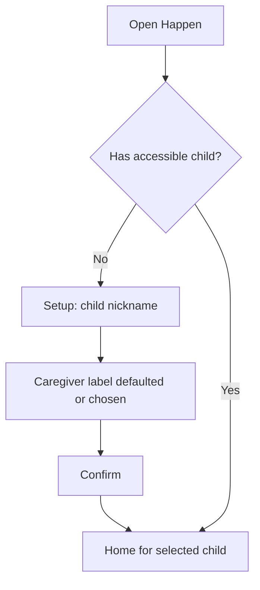
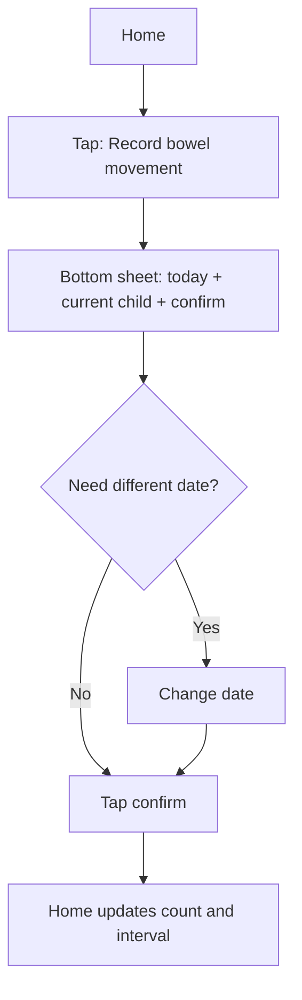
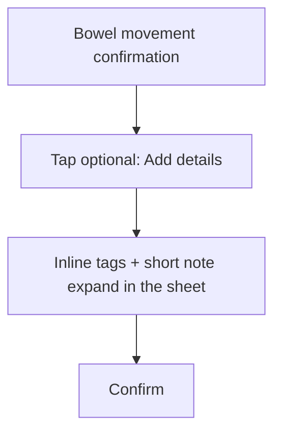
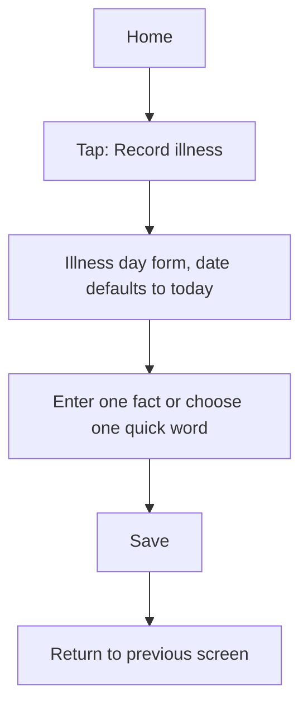
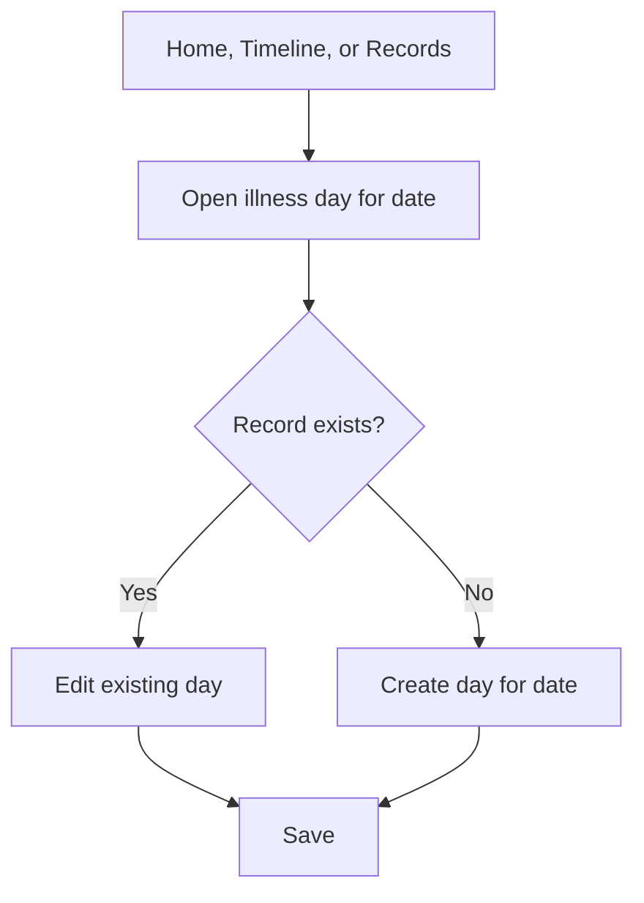
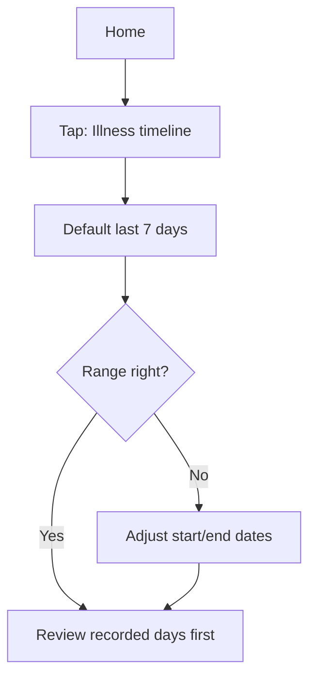
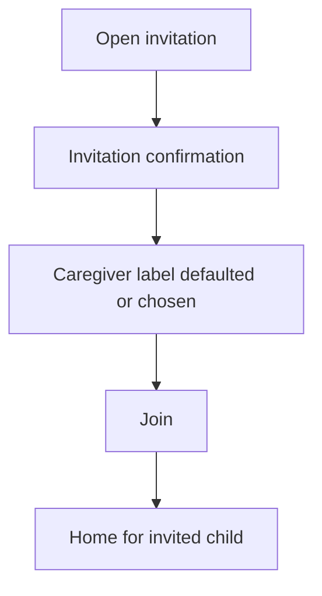

# Happen UX Prototype

This prototype defines the MVP user experience structure for Happen. It is not a visual design brief and does not define color, brand, typography, illustration, or polished UI style.

This version optimizes the prototype around one principle:

> A caregiver opens Happen mainly to record something that already happened.

The primary interaction target is:

> Recording a bowel movement should take two taps after Home appears. Recording an illness day should be possible with one quick fact and Save.

The MVP should feel like a child-scoped quick recording workspace, not a record management app.

## 1. Information Architecture

### Navigation Model

Happen should be Home-first.

Recommended MVP structure:

1. `Home`
   - Current child context.
   - Bowel movement status.
   - Two fast record actions.
   - Entry to illness timeline.
   - Lightweight entry to record correction.
2. `Child Settings`
   - Child nickname.
   - My caregiver label.
   - Caregiver list.
   - Invite caregiver.
3. `Records`, as a secondary page reached from Home, not a bottom tab.
   - Bowel movement records by date.
   - Illness day records by date.
   - Correction and browsing only.

MVP bottom navigation should stay as small as possible:

- Prefer no bottom tab bar if the Mini Program can keep Home as the default workspace with Settings as a small top-level entry.
- If a tab bar is required by implementation, use only `Home` and `Settings`.
- Do not put `Records` in the bottom tab bar for MVP.

The key rule is:

> Recording actions must be visible on Home and must never be hidden behind record browsing.

### Child Context

Every screen is scoped to one selected child. The current child must be visible before any save or confirm action.

Child context behavior:

- One child: show child nickname as context, without selector friction.
- Multiple children: tapping the child nickname opens the child switcher.
- Switching child immediately changes status, records, timeline, and settings.
- Record forms show the current child near the date to reduce wrong-child entry.
- Adding another child is low-frequency. If supported in MVP, place it in Child Settings, not as a prominent action in the child switcher.

### Content Hierarchy

Happen should prioritize in this order:

1. Fast record action for already-happened facts.
2. Immediate review answer for bowel movement interval.
3. Illness timeline review for doctor conversations.
4. Record management and correction.
5. Shared caregiver setup.

This order matters. Settings, invitation, and record browsing should not compete with daily recording.

## 2. User Flows

### Flow A: First Use

Goal: reach a usable child Home with minimal setup.



Efficiency rules:

- Setup asks only for child nickname and caregiver label.
- Caregiver label should have a default value, such as `Me`, `Mom`, or the most locally appropriate default, so the user usually only types the child nickname.
- Do not ask for birthday, avatar, gender, real name, family name, medical profile, or family role.
- Setup must be one screen.

### Flow B: Record One Bowel Movement

Goal: record one already-happened bowel movement within 5 seconds.



Fast path:

1. Open app.
2. Tap `Record bowel movement`.
3. Tap `Confirm`.

The bottom sheet exists to prevent accidental automatic record creation. It must feel like a confirmation, not a form.

### Flow C: Add Bowel Movement Details

Goal: keep the fast path fast while still allowing lightweight detail.



Details are secondary. `Add details` should expand lightweight tags and a note inside the confirmation sheet. It should not send the user to the full record editor.

### Flow D: Record Illness Facts

Goal: capture enough facts for later review without a clinical timeline.



Fast path examples:

- Tap `Record illness` -> tap `Fever` -> Save.
- Tap `Record illness` -> type `39.2` -> Save.
- Tap `Record illness` -> type `night cough, slept poorly` -> Save.

The Home action should not say `Record today's illness`, because caregivers often need to backfill yesterday or another recent day. The form date still defaults to today.

### Flow E: Update An Existing Day

Goal: allow later correction without duplicate records.



When the selected date already has a note, the form is an editor, not a new-entry form.

### Flow F: Doctor-Visit Review

Goal: review recent illness facts in about 2 minutes.



Timeline review should support scanning, not reporting. The user should be able to read date, temperature, medicine, symptoms, and notes without opening every day.

### Flow G: Shared Caregiver Join

Goal: let another caregiver access one child without family-management setup.



The join flow should explain access meaning briefly, then move the caregiver into the same child workspace.

Invitation should not appear in first-use setup or daily recording flows.

## 3. Page Structure

### First-Use Setup

Purpose: create the minimum child context.

Structure:

- Header: short setup title.
- Child nickname input.
- Caregiver label quick choices, with one default selected.
- Custom caregiver label input only after choosing custom.
- Primary action: start.

Interaction notes:

- Keep this as a single screen.
- Auto-focus child nickname if platform behavior is not disruptive.
- Confirm remains disabled until child nickname is present and caregiver label has a value.
- Do not show invitation, medical profile, family setup, or add-more-child prompts here.

### Home

Purpose: record first, review second.

Structure:

- Top bar:
  - Current child nickname.
  - Child switch affordance only if the user has more than one child.
  - Small settings icon or text entry.
- Bowel movement status:
  - Direct answer such as `Days since last bowel movement: 2`.
  - Specific last date when useful.
  - Today's count if present.
- Primary fast actions:
  - `Record bowel movement`.
  - `Record illness`.
- Review actions:
  - `Illness timeline`.
  - `View or edit records`, visually secondary.
- Recent edit hint only when useful:
  - Show last editor only if there is more than one caregiver or another caregiver edited a record.

Interaction notes:

- The most reachable control should be `Record bowel movement`.
- `Record illness` must be visible on Home, not nested under Records.
- `Illness timeline` should be visible but less dominant than record actions.
- `View or edit records` is for correction and browsing, not daily recording.
- Settings and invitation must not visually compete with the record actions.
- Home should not begin with analytics, charts, invitations, education, or onboarding content.

### Bowel Movement Confirmation Sheet

Purpose: explicit save with minimal friction.

Structure:

- Current child label.
- Date field defaulted to today.
- Count impact text, such as `This will add 1 time for today`.
- Primary action: confirm.
- Secondary action: add details.
- Cancel.
- Collapsed details:
  - Optional observation tags.
  - Optional short note.

Interaction notes:

- Confirm is available immediately.
- Changing date is optional.
- Observation tags and notes stay hidden unless the user taps `Add details`.
- Successful confirmation returns to Home and updates status.
- Opening the sheet must not create a record.

### Bowel Movement Record Editor

Purpose: correct or enrich an existing date-level record.

Structure:

- Date.
- Count stepper and direct numeric input.
- Optional observation tags.
- Optional short note.
- Last editor label when useful.
- Save.
- Delete.

Interaction notes:

- This editor is reached from record correction entry points, not from the normal `Add details` path.
- Delete requires confirmation because it can change interval status.
- If count is set to zero or empty, block save or offer deletion.

### Illness Day Form

Purpose: record or update a day-level illness note.

Default visible structure:

- Current child label.
- Date, defaulted to today.
- Highest temperature input.
- Symptom quick words.
- One free-text field for symptoms and notes.
- Save.

Secondary expandable structure:

- Medicine text entry.
- Recent medicine words previously entered for this child, if available.
- Recording-only safety copy for medicine words.
- More note space if needed.

Interaction notes:

- Save is allowed once any fact besides date exists.
- Quick words insert editable or removable text/chips.
- Do not prefill generic medicine quick words as if they are recommendations.
- If no medicine history exists, medicine entry should be a plain optional text area rather than a prominent list of drug names.
- On save, return to the previous screen by default.

### Illness Timeline

Purpose: scan day-by-day facts for a selected date range.

Structure:

- Current child label.
- Date range selector.
- Day count.
- Recorded days shown first in chronological order.
- Compact indication for dates with no record, without guilt-inducing language.
- Each recorded day shows only present facts:
  - Highest temperature.
  - Medicines.
  - Symptoms.
  - Note.
  - Last editor where useful.
- Empty range state.

Interaction notes:

- Default range is most recent 7 days ending today.
- The timeline may cover 7 days, but empty days should not dominate the page.
- Each day row can open the illness day form for that date.
- Timeline should not summarize, diagnose, infer an illness episode, or look like a medical report.

### Records

Purpose: browse and correct date records.

Records is secondary. It is reached from Home and should not be a bottom tab in MVP.

Structure:

- Current child label.
- Segmented control:
  - Bowel movement.
  - Illness days.
- Date-grouped list.
- Empty state per type.
- Optional lightweight add entry for the selected record type.

Interaction notes:

- Records is for correction and browsing, not the primary recording route.
- Date grouping should stay consistent with Timeline and editors.
- If a caregiver reaches Records by trying to fix a recent mistake, the path to edit that date must be obvious.

### Child Selector

Purpose: switch current child safely.

Structure:

- List of accessible children.
- Current child indicator.

Interaction notes:

- Switch happens only after user taps a child.
- After switch, return to the previous screen if the context remains valid.
- Do not make `Add child` a prominent action here. If supported, keep it in Child Settings.

### Child Settings

Purpose: manage minimal shared access.

Structure:

- Child nickname.
- My caregiver label.
- Caregiver list by display label.
- Invite caregiver.
- Add another child, only if MVP supports adding more after first setup.

Interaction notes:

- Do not add role controls.
- Do not show chat, comments, feed, approvals, read-only switches, or family workspace concepts.
- Invitation is useful but low-frequency. It should stay in Settings, not daily record surfaces.

### Invitation Confirmation

Purpose: join one child's shared records.

Structure:

- Child nickname.
- Short access explanation.
- Caregiver label quick choices, with a default if appropriate.
- Join.
- Invalid or expired invitation state.

Interaction notes:

- Joining takes the user to that child's Home.
- If already joined, skip duplicate setup and enter Home.
- Do not ask for family role, real name, phone number, or relationship hierarchy in MVP.

## 4. Page Transitions

### Primary Transitions

| From | Action | To | Notes |
| --- | --- | --- | --- |
| App open | Has no child | First-Use Setup | No records are created |
| App open | Has child | Home | Last selected child if valid |
| Home | Tap child name | Child Selector | Only if multiple children |
| Home | Tap settings | Child Settings | Current child scoped |
| Home | Tap record bowel movement | Bowel Confirmation Sheet | Date defaults to today |
| Bowel Confirmation Sheet | Confirm | Home | Status updates |
| Bowel Confirmation Sheet | Add details | Inline detail expansion | Stay in sheet |
| Home | Tap record illness | Illness Day Form | Date defaults to today |
| Illness Day Form | Save | Previous screen | Home or Timeline |
| Home | Tap illness timeline | Illness Timeline | Default last 7 days |
| Illness Timeline | Tap date row | Illness Day Form | Edit existing or create for date |
| Home | Tap view/edit records | Records | Secondary correction path |
| Records | Tap bowel date | Bowel Movement Record Editor | Edit existing date |
| Records | Tap illness date | Illness Day Form | Edit existing date |
| Settings | Invite caregiver | WeChat share | Child-scoped invite |
| Invitation link | Open valid invite | Invitation Confirmation | Requires join confirmation |
| Invitation Confirmation | Join | Home | Invited child selected |

### Back Behavior

- Closing a sheet returns to the previous screen with no saved changes.
- Back from an unsaved form asks whether to discard only if the user has entered content.
- Successful quick bowel recording returns directly to Home.
- Timeline date range changes stay on Timeline.
- Records returns to Home, not to another management layer.

### Error And Empty Transitions

- Network failure on save: stay on the form or sheet, preserve input, show retry.
- Invalid invitation: show an invitation error screen, do not enter Home through that invite.
- No illness notes in range: stay on Timeline with actions to record illness or change date range.
- No bowel record yet: Home shows an empty state instead of an incorrect interval.
- If a date has no record inside Timeline, show it compactly and calmly.

## 5. Low-Fidelity Wireframes

### First-Use Setup

```text
+--------------------------------+
| Happen                         |
|                                |
| Child nickname                 |
| [ e.g. Dou Dou              ]  |
|                                |
| My label                       |
| [Me] [Mom] [Dad] [Grandma]    |
| [ Custom ]                     |
|                                |
|              [ Start ]         |
+--------------------------------+
```

### Home

```text
+--------------------------------+
| Dou Dou v                   ...|
|--------------------------------|
| Bowel movement                 |
| Days since last: 2             |
| Last date: Jun 3               |
| Today: 1 time                  |
|                                |
| [ Record bowel movement ]      |
| [ Record illness ]             |
|                                |
| Review                         |
| [ Illness timeline ]           |
| View or edit records           |
+--------------------------------+
```

### Bowel Movement Confirmation Sheet

```text
+--------------------------------+
| Record bowel movement          |
| Child: Dou Dou                 |
| Date: [ Today v ]              |
|                                |
| Add 1 time for this date.      |
|                                |
| [ Confirm ]                    |
| Add details             Cancel |
+--------------------------------+
```

### Bowel Movement Confirmation With Details Expanded

```text
+--------------------------------+
| Record bowel movement          |
| Child: Dou Dou                 |
| Date: [ Today v ]              |
|                                |
| Add 1 time for this date.      |
| [Loose] [Hard] [Small amount] |
| Note [                       ] |
|                                |
| [ Confirm ]            Cancel  |
+--------------------------------+
```

### Bowel Movement Editor

```text
+--------------------------------+
| Bowel movement record          |
| Child: Dou Dou                 |
| Date: [ Jun 5 v ]              |
| Count:       [-]  2  [+]       |
|                                |
| Observation                    |
| [Loose] [Hard] [Small amount] |
| [Frequent] [Strained]          |
|                                |
| Note                           |
| [                            ] |
|                                |
| [ Save ]              [Delete] |
+--------------------------------+
```

### Illness Day Form

```text
+--------------------------------+
| Record illness                 |
| Child: Dou Dou                 |
| Date: [ Today v ]              |
|                                |
| Highest temperature            |
| [       ] C                    |
|                                |
| Symptoms                       |
| [Fever] [Cough] [Runny nose]  |
| [ symptom or note text      ]  |
|                                |
| Medicine                       |
| Add medicine used              |
|                                |
| [ Save ]                       |
+--------------------------------+
```

### Illness Day Form With Medicine Expanded

```text
+--------------------------------+
| Medicine used                  |
| Recording only, not advice.    |
| [Recent: Ibuprofen] [ORS]     |
| [ medicine text             ]  |
+--------------------------------+
```

### Illness Timeline

```text
+--------------------------------+
| Illness timeline        Dou Dou|
| Date range: Jun 1 - Jun 7  [v] |
| 7 days                         |
|--------------------------------|
| Jun 1                          |
| Temp: 38.7 C                   |
| Symptoms: Fever, cough         |
| Medicine: Ibuprofen at night   |
| Note: Slept poorly             |
|--------------------------------|
| Jun 3                          |
| Symptoms: Runny nose           |
| Note: Appetite better          |
|--------------------------------|
| 5 days with no record          |
+--------------------------------+
```

### Records

```text
+--------------------------------+
| Records                 Dou Dou|
| [Bowel movement] [Illness days]|
|--------------------------------|
| Today                          |
| Bowel movement: 1 time     >   |
|--------------------------------|
| Jun 4                          |
| Bowel movement: 2 times    >   |
|--------------------------------|
| Jun 3                          |
| Bowel movement: 1 time     >   |
+--------------------------------+
```

### Child Settings

```text
+--------------------------------+
| Child settings                 |
| Child nickname                 |
| [ Dou Dou                   ]  |
|                                |
| My label                       |
| [ Mom                       ]  |
|                                |
| Caregivers                     |
| Mom                            |
| Grandma                        |
|                                |
| [ Invite caregiver ]           |
+--------------------------------+
```

## 6. Recording Efficiency Optimizations

### Keep The Fast Path Sacred

The fastest bowel movement path should be:

```text
Open -> Record bowel movement -> Confirm
```

This is the main benchmark for the 5-second goal. Optional detail must never become required work.

### Default Today, But Never Auto-Save

Dates default to today because most recording is same-day. However, no screen opening should create a record. The explicit save or confirm action is the boundary between intent and data.

### Make Details Progressive

Bowel movement tags, notes, medicine text, symptom text, and timeline range editing are useful, but secondary. The interface should reveal them only after the quick action is understandable.

### Prefer User-Words Over System Suggestions

Quick words reduce typing, but they must feel like recording shortcuts, not recommendations.

- Symptom quick words may be generic and lightweight.
- Medicine quick words should prefer recent user-entered words for that child.
- If no medicine history exists, show a text entry first instead of a list of drug names.

### Use Date-Level Records

The MVP should avoid minute-level event logs. One date has one bowel movement count and one illness day note. This keeps review and correction simple.

### Avoid Decision Fatigue

Do not ask the user to classify every record. Avoid required stool type, required symptom severity, required medicine timing, required dosage, or required exact time.

### Recover From Rushed Mistakes

Fast entry increases the chance of wrong date, wrong child, or accidental count. The UX should make correction easy:

- Current child visible in every record sheet.
- Date visible before confirmation.
- Date records editable.
- Count can be decremented or corrected.
- Delete available with confirmation.

### Let Timeline Drive Review, Not Entry

The illness timeline is for reading and explaining. It should not force a caregiver to open each day unless they want to edit it.

### Keep Low-Frequency Work Out Of The Way

Inviting caregivers, adding another child, editing labels, and browsing old records are valuable, but they are not the daily habit. Keep them outside the main recording path.

### Performance Expectations

The first screen should load enough cached or server data to show:

- Current child.
- Bowel movement interval.
- Today's bowel movement count.
- Primary record actions.

If full records are still loading, the user should still be able to start a new explicit record action as soon as child context is known.

## 7. Usage Risk Checks

### First Use

Risk:

- User opens Happen while needing to record immediately.
- Any setup beyond child nickname can cause abandonment.

Required prototype behavior:

- One setup screen.
- Caregiver label defaulted or one-tap selectable.
- No medical profile.
- No invitation prompt.
- Land directly on Home after setup.

### Continuous Use For 7 Days

Risk:

- Repeated scanning of secondary actions makes the product feel heavier than paper or notes.
- Illness form density discourages daily updates.

Required prototype behavior:

- Home keeps two primary record actions stable.
- Bowel details stay collapsed.
- Illness form allows one fact and Save.
- Timeline can be reviewed without opening each day.

### Continuous Use For 30 Days

Risk:

- The product turns into record management instead of quick recording.
- Old empty days and low-frequency settings clutter the experience.

Required prototype behavior:

- Records remains secondary.
- Timeline compresses empty days.
- Settings and invitation stay out of daily surfaces.
- Corrections remain easy when needed.

## 8. UX Acceptance Checks

Use these checks before Figma design and implementation:

1. Can a caregiver record today's bowel movement with two taps after Home appears?
2. Can a caregiver record an illness day with one quick word or one text fact and save?
3. Is the current child visible before every save?
4. Can the user correct a wrong date or count without searching through Settings?
5. Can Timeline answer doctor-visit questions without opening each day?
6. Does any screen ask for information not needed for recording or review?
7. Does any page use generic event-management language?
8. Does any medicine quick word look like a recommendation?
9. Does any empty state create guilt for not recording?
10. Can an invited caregiver join one child and land directly in that child's Home?
11. Is Records absent from MVP bottom navigation?
12. Are invitation and add-child actions kept out of the daily recording path?
