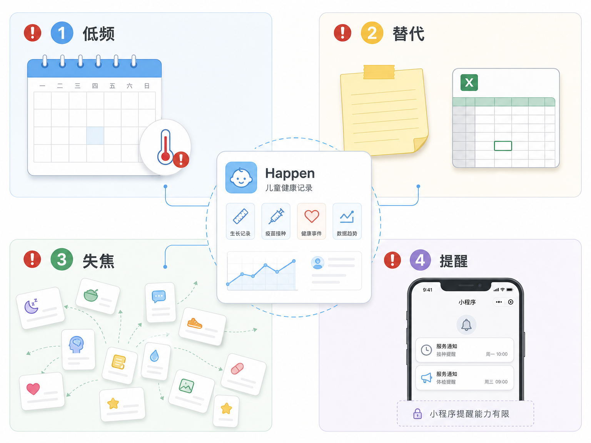
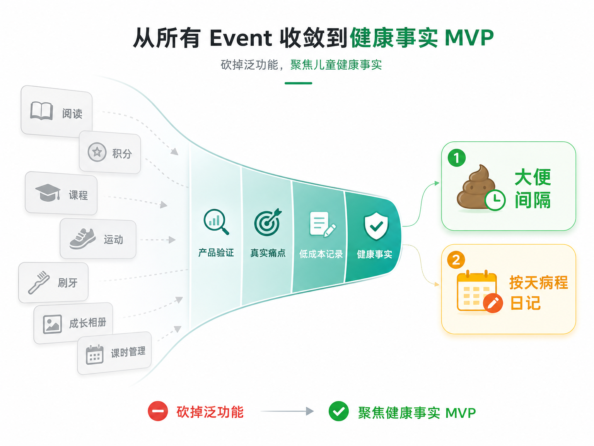

# 我差点把一个育儿 App 做成“大而全”，直到被连续追问 18 次

有些产品不是死在没人会做，而是死在“看起来什么都能做”。

Happen 一开始也是这样。

我想做一个工具，帮助家长记录孩子发生过的重要事件。听起来很自然：大便、发烧、吃药、上网课、阅读、刷牙、运动，都可以记录。再加一点统计和回顾能力，似乎就是一个完整的儿童成长记录产品。

但越往下想，我越发现一个危险：

如果所有事情都能记，那用户为什么不用备忘录？

于是我把这个想法拿出来做了一次产品拷问。我给对方设定了三个角色：连续创业者、产品负责人、独立开发顾问。要求很简单：不要帮我设计功能，不要生成 PRD，不要发散需求，只帮我找这个产品失败的原因。

这篇笔记记录的不是一个产品方案，而是一次把想法从“我觉得有用”压到“可能值得验证”的过程。

## 第一个问题：你到底遇到过什么真实痛点？

最开始，我说 Happen 是：

> 帮助家长记录孩子发生过的重要事件，并提供统计和回顾能力。

这句话最大的问题是太顺了。

它没有错，但它也不锋利。任何记录工具都可以这么说。

真正把问题打穿的是一个追问：

> 过去 3 个月里，有没有一个具体时刻，因为没记录孩子发生过什么，导致了真实损失、焦虑、沟通成本或决策困难？

这个问题一下把抽象愿景拉回现实。

我想到的第一个场景是看医生。

孩子发烧的时候，我经常说不清：

- 哪天开始烧？
- 烧了几天？
- 最高体温多少？
- 中途吃过什么药？
- 症状怎么变化？
- 精神状态怎么样？

有时我会在家里的日历本上写几笔，但带孩子去医院时又要记得拍照。不拍照就靠记忆，到了医生面前还是说不清。

第二个场景是大便。

我家小孩大便不是每天都有，可能三四天才一次。我需要知道距离上次大便多久了。如果太久没拉，可能要关注，甚至干预。

这两个场景让我意识到：Happen 真正的机会不是“记录孩子成长”，而是帮家长在关键时刻回答过去发生过什么。

## 第二个问题：这些场景真的属于同一个产品吗？

我一开始列了很多事件：

- 大便
- 发烧
- 吃药
- 上网课
- 阅读
- 刷牙
- 运动

它们确实都有一个共性：都发生在某一天。

但这个共性太弱了。

因为备忘录、Excel、日历、微信收藏，也都能记录“某天发生了什么”。

真正的产品风险在这里：

> 如果用 Event 统一一切，工程上很干净，产品上却可能很模糊。

用户不是来“新增事件”的。

家长想要的是：

- 记一次大便
- 记今天最高体温
- 记吃过什么药
- 记主要症状
- 看医生前回看这次病程

所以最后我们达成一个判断：

> Event 可以是后端数据抽象，但不应该是前端产品语言。

前端应该说“记大便”“记病程”“查看病程”，而不是“新增事件”“事件类型”“事件统计”。

这一步很关键。它防止 Happen 变成一个披着育儿外衣的通用记录本。

## 第三个问题：最强痛点低频，怎么办？

病程记录是很强的痛点，但它有一个天然问题：低频。

孩子不生病时，家长不会打开。

这不一定说明产品没有价值。很多工具都是关键时刻才有用。但对于一个微信小程序来说，低频还有另一个麻烦：

用户第一次看到觉得不错，但孩子当下没发烧，就不一定收藏。过几个月孩子发烧了，他可能想不起这个工具叫什么。

这就是 Happen 最大的召回风险。

为了避免这个问题，我原本很容易走向“加一些日常功能”：

- 阅读打卡
- 运动记录
- 刷牙记录
- 积分兑换
- 课程统计

但这条路很危险。

这些功能会提高打开频率，但它们会把产品带到另一个方向：泛育儿任务管理工具。

于是我们做了一个更克制的判断：

> 如果要找日常锚点，它必须仍然属于健康事实。

最后留下的是大便记录。

它比发烧高频，又和健康关注有关。它的即时价值也清楚：

> 距离上次大便已经几天了？

这不是复杂统计，也不是健康分析，只是一个很简单、很即时的问题。

但即便如此，我们仍然没有把它当成已经成立的答案。因为没有可靠提醒时，用户是否会主动打开 Happen 仍然未知。

所以大便记录不是确定的增长引擎，而是 MVP 要验证的关键假设。

## 第四个问题：记录到底要多精细？

一开始我以为病程记录应该是一条条事件流：

- 10:03 体温 38.5°C
- 13:20 吃药
- 17:40 体温 39.0°C

但这不符合我的真实行为。

我更可能记录的是：

> 6 月 1 日：最高体温 39.0°C；上午吃了布洛芬，下午吃了小儿柴桂；咳嗽，精神一般。

这说明第一版不应该追求分钟级精确记录。

更合理的是按天维护病程日记：

- 当天最高体温
- 当天吃过哪些药
- 当天主要症状
- 备注

药物可以保留轻量补救，比如用户自己写“上午”“下午”“睡前”“约几点”。

这不是医学级时间线，但它足够回答看医生时最常见的问题。

更重要的是，它降低了录入成本。

孩子生病时，家长不是坐在电脑前填表，而是在半夜量体温、喂药、哄睡、焦虑。这个时候，多一个字段都可能让人放弃。

## 第五个问题：AI 要不要进 MVP？

AI 总结当然吸引人。

如果 Happen 能把几天记录自动整理成一段病情摘要，听起来很有卖点。

但这里也有明显风险：

- 用户录入不完整，AI 却总结得很像完整病历
- AI 一旦像诊断建议，就会越过产品边界
- 医疗相关内容如果不准，信任会掉得很快
- 成本、审核、责任边界都会变重

所以最后的结论是：

> AI 作为第二阶段卖点，不进入 MVP 核心。

第一版先做准确的按天病程时间线。

AI 后续可以做事实整理，但不能做医学判断。

它可以说：

> 6 月 1 日晚开始发热，最高 39.2°C；6 月 2 日服用布洛芬 1 次，退热后反复；伴有咳嗽，精神一般。

但不能说：

> 可能是病毒感染，建议吃什么药，暂时不用去医院。

这条边界必须写死。

## 最终收敛：Happen 第一版到底是什么？

经过这轮追问，Happen 从一个很宽的想法：

> 记录孩子发生过的重要事件。

收敛成了一个更窄的验证方向：

> 儿童健康事实记录：平时记大便，生病时记按天病程，看医生时快速回看。

第一版只服务健康事实，明确排除：

- 阅读
- 积分
- 课程
- 运动
- 刷牙
- 成长相册
- 育儿社区
- AI 问诊

统计也只做很轻的部分：

- 距离上次大便 X 天
- 本次病程持续 X 天

不做健康数据仪表盘。

不做长期趋势分析。

不做复杂用药统计。

第一版真正要验证的不是“功能能不能做”，而是：

> 家长是否真的愿意用一个轻量工具，持续记录少量关键健康事实，并在需要时通过它快速回答过去发生了什么。

## 最后一刀：先别急着开发

这轮对话最有价值的地方，不是产出了一个更清晰的 MVP，而是给开发前设了一个门槛。

在正式做公开版本前，先找 5 个目标家长做轻量验证。

不要问：

> 如果有这样一个工具，你会不会用？

这种问题很容易得到礼貌性赞同。

应该问真实经历：

1. 最近一次孩子生病、便秘或吃药，你是怎么记录的？
2. 当时有没有发生“想查但查不到、说不清、记不住”的情况？
3. 如果有一个小程序只解决“大便间隔 + 病程日记”，你会不会当场收藏或试用？

通过标准也要硬一点：

- 5 个家长里，至少 3 个讲出具体记录困难
- 至少 2 个愿意当场收藏或试用

如果达不到，就先做自用极简版，不急着推广，不做复杂后端。

这听起来克制，但对独立开发者很重要。

因为最贵的不是写代码，而是写了很多代码之后，才发现自己只是把一个个人痛点包装成了大众产品。

## 我从这次合作里学到的

这次最大的收获，是我开始区分三件事：

第一，真实痛点不等于产品机会。

我自己确实遇到了记录困难，但还需要验证其他家长是否也有类似问题。

第二，低频强痛点不等于可以直接做。

看医生时说不清病程很痛，但如果用户平时想不起产品，仍然可能失败。

第三，统一抽象不等于用户心智。

“Event”对开发者很好，但对家长太泛。产品语言必须贴近用户当下的动作和问题。

最后，Happen 现在还不是一个已经被证明的产品。

它只是一个更值得被验证的假设。

而这恰恰是这轮对话的价值：不是让我更兴奋地开工，而是让我更清醒地知道，什么值得做，什么暂时不该做。
