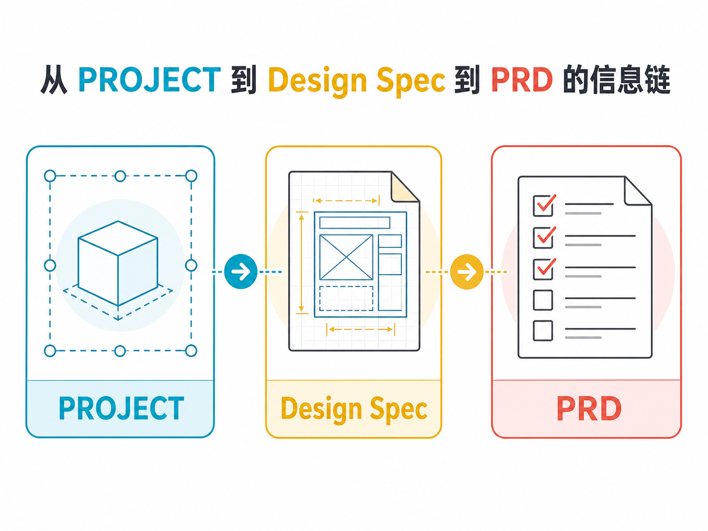
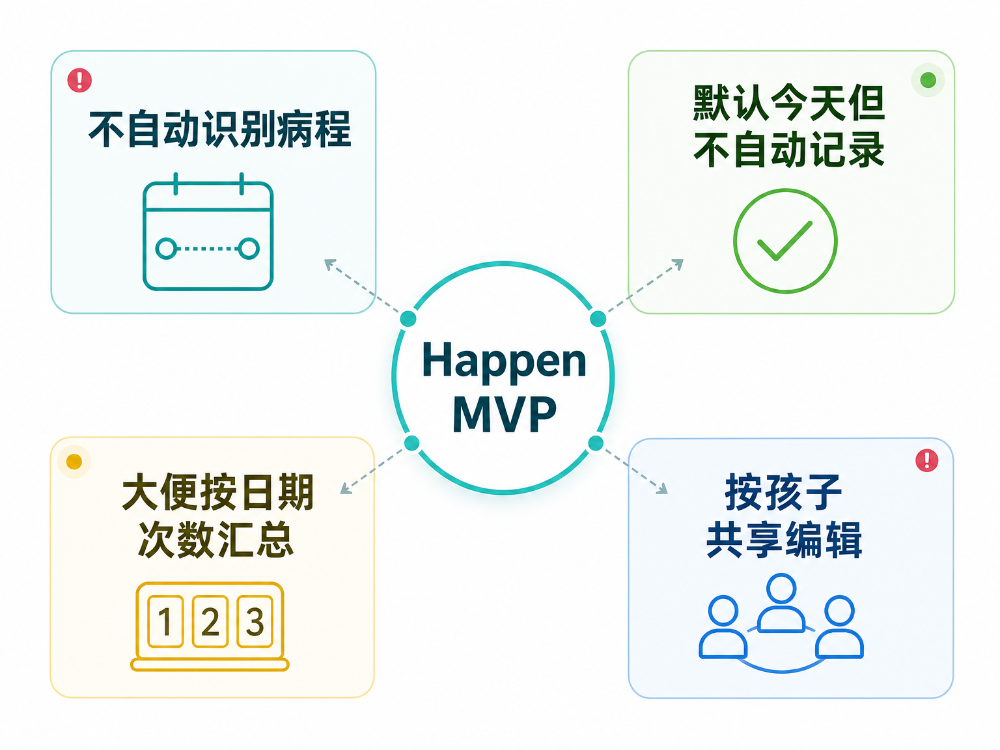
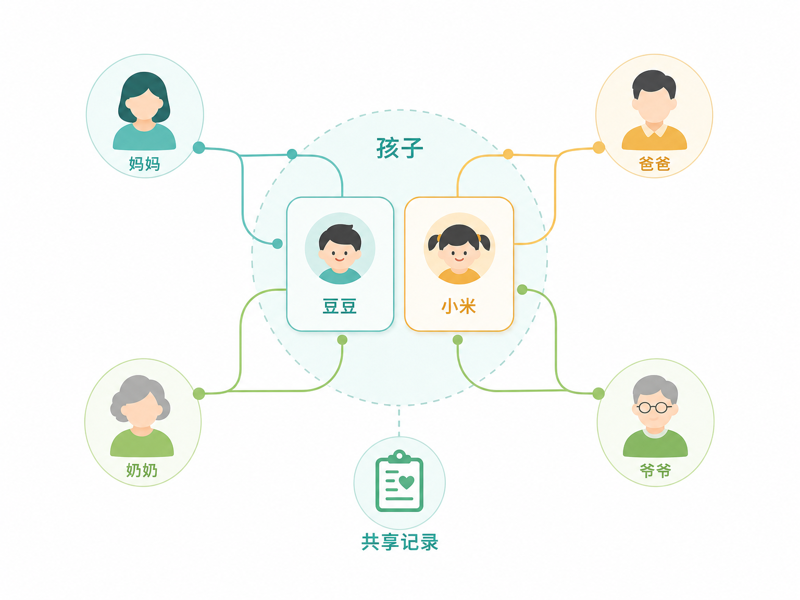

# 我以为是在和 AI 聊需求，结果它逼我补上了产品的骨架

很多人用 AI 做产品，最容易掉进一个坑：

把 AI 当成“功能生成器”。

你说一句“帮我做个育儿 App”，它就能给你列出首页、打卡、提醒、统计、社区、AI 问诊、成长相册。看起来很完整，甚至很专业。

但这类完整，往往是危险的。

因为产品还没证明自己为什么存在，功能已经开始膨胀了。

这次我和 AI 的协作，反而不是让它多想功能，而是反复要求它：

> 不要改产品定位。  
> 不要扩大产品范围。  
> 只围绕 PROJECT.md 的边界，帮我寻找更好的 MVP。

最后，我们没有得到一堆炫技功能。

我们得到的是一个更稳的产品骨架。

## 第一刀：先确认 MVP 到底验证什么

一开始，Happen 已经有一个清晰但还不够落地的方向：

> 儿童健康事实记录：平时记大便，生病记病程，看医生快速回看。

这句话听起来不错，但还不能直接指导 MVP。

因为它里面至少藏着三个不同风险：

- 家长愿不愿意记录？
- 记录后回看是否真的有价值？
- 大便记录能不能形成日常打开？

如果三个都想验证，MVP 就会变胖。

所以第一步不是列功能，而是选验证目标。

这次我们选的是：

> 回看价值。

也就是看医生或复诊前，家长能不能用 Happen 在 2 分钟内把最近几天说清楚。

这个选择很关键。

它让 MVP 不再追求“什么都能记”，而是追求“关键时刻能不能说清楚”。

## 第二刀：拒绝看似聪明的自动病程

病程记录里最容易出现一个诱人的设计：

系统自动判断一次病程。

比如用户连续几天记录发热，系统就把它们合并成一次病程。

听起来很顺。

但仔细想，会有很多麻烦：

- 用户漏记了一天怎么办？
- 孩子好了两天又反复怎么办？
- 系统把两次病合成一次怎么办？
- 系统猜错时，用户到底改哪里？

这类功能很容易从“智能”变成“自作聪明”。

而 MVP 要验证的是回看价值，不是自动归并算法。

所以最后我们选择了一个更朴素的方案：

> 平时只记录病程日；回看时由用户选择日期范围。

进入病程时间线时，默认展示最近 7 天。

如果不合适，用户再手动修改开始和结束日期。

这不是最酷的方案，但它把控制权还给了用户。

产品也不再说“系统识别出本次病程”，只说“日期范围”。

有些 MVP 的高级感，不来自智能，而来自不乱猜。

## 第三刀：把“默认今天”和“自动记录”分开

在大便记录里，我们遇到一个很小但很重要的歧义。

我说：

> 默认记录今天发生过大便。

这个说法其实不严谨。

用户马上追问：

> 是我打开小程序就自动记录了，还是我点击按钮后才默认选今天？

这个问题很小，但它打破了一个关键歧义。

最后我们明确：

> 打开小程序不会自动记录。  
> 用户点击“记一次大便”后，日期默认今天。  
> 只有用户确认后，才保存健康事实。

这个原则后来也扩展到了病程日：

> 默认值可以减少输入成本，但不能替用户创建事实。

健康记录产品里，信任很脆。

一条自动生成的错误记录，可能比没有记录更糟糕。

## 第四刀：大便不是“今天有没有”，而是“今天几次”

一开始，大便记录被设计成：

> 某一天发生过大便。

但这个模型很快暴露问题。

Happen 面向 0-12 岁孩子。年龄小的孩子一天拉几次很正常。

如果同一天只能有一条“发生过”，那今天拉了三次怎么表达？

更进一步，家长有时关心的不是普通记录，而是和平时不一样：

- 偏稀
- 偏硬
- 量少
- 次数多
- 有点费劲

这些信息如果完全不让记，可能太粗。

但如果做大便形态分级、颜色、照片、医学解释，又会超出 MVP。

最后我们选了一个中间模型：

> 同一天一条日期汇总记录，但里面有次数和可选观察备注。

也就是说：

- 今天可以记录 3 次。
- 可以手动调整次数。
- 和平时不一样时，可以选轻量标签或写备注。
- 不做医学分级。
- 不做异常提醒。
- 不做照片分析。

这一步的价值是：没有扩大产品定位，但修正了数据模型。

好的 MVP 不是越少越好。

好的 MVP 是少到刚好不失真。

## 第五刀：真正的记录者，可能不是看医生的人

后来又出现一个更大的问题：

如果妈妈记录了病程，但爸爸带孩子去医院，爸爸怎么看？

如果家里有两个孩子呢？

如果爷爷奶奶也会帮忙记录呢？

这不是锦上添花。

它直接影响核心价值：

> 谁去看医生，谁都能说清楚。

所以我们把模型从“一个家长记录一个孩子”改成：

> 一个孩子可以有多个共同照护者。  
> 一个照护者也可以访问多个孩子。

但这里也有边界。

共享编辑很容易滑向家庭协作平台：

- 家庭群组
- 聊天
- 动态
- 角色权限
- 审批
- 家庭相册

这些全部不进 MVP。

MVP 只做最小共享闭环：

- 按孩子邀请共同照护者。
- 被邀请者都可以查看和编辑。
- 每个人给自己选一个照护称呼，比如妈妈、爸爸、奶奶。
- 称呼不要求唯一。
- 记录保留创建者和最后编辑者。

它不是家庭社交。

它只是让健康事实在真正需要的人手里。

## 最后，不是 PRD，而是 PRD 的上游

这次协作最后产出了几类文档。

第一类是 `PROJECT.md`。

它定义产品边界：

> Happen 是什么，不是什么。

它像产品的宪法。

第二类是 MVP Design Spec。

也就是：

- `2026-06-04-happen-mvp-review-value-design.md`
- `2026-06-04-happen-mvp-review-value-design-cn.md`

它回答：

> 在这个边界内，MVP 准备怎么做，为什么这样做，核心模型、页面、流程、交互边界是什么。

它不是 PRD。

它更像 PRD 的上游设计蓝图。

以后生成 PRD 时，不应该重新发散，而应该从这份设计往下展开。

比如 Design Spec 里写：

> 点击“记一次大便”后，该日期次数 +1。

PRD 才会继续展开：

- 弹什么面板？
- 日期默认值是什么？
- 次数能不能改？
- 删除怎么确认？
- 接口字段是什么？
- 验收标准是什么？

这也是这次协作最值得学习的地方：

不要急着让 AI 写 PRD。

先让它帮你把产品边界、关键选择和反选择说清楚。

## 这次协作给我的 5 个启发

**第一，先选验证目标，再选功能。**

如果 MVP 同时验证录入意愿、回看价值、日常留存，最后会变成一个小而全产品。

**第二，智能不是默认更好。**

自动判断病程看起来聪明，但它会把 MVP 的风险转移到系统猜得准不准。

**第三，默认值不能替用户创造事实。**

健康记录里，默认今天可以，但自动记录不行。

**第四，少做不等于粗糙。**

大便记录从“有没有”改成“日期 + 次数 + 可选观察”，是为了更贴近真实场景。

**第五，共享编辑不是社交功能。**

多照护者是为了看医生时能说清楚，不是为了做家庭空间。

## 如果你也想用 AI 做产品设计

可以试试这几个提问方式：

1. 不要先问“帮我生成 PRD”，先问“这个 MVP 到底验证什么？”
2. 每出现一个智能功能，都追问：“如果它猜错了怎么办？”
3. 每出现一个默认行为，都追问：“这是默认值，还是自动创建事实？”
4. 每出现一个新用户关系，都追问：“这是基础模型，还是范围膨胀？”
5. 每产出一份文档，都问：“它和 PROJECT、Design Spec、PRD 的关系是什么？”

产品设计很多时候不是加法。

是把每个听起来合理的功能，放回真实场景里拷问一遍。

这次 Happen 的 MVP 变好了，不是因为功能更多。

而是因为那些容易误导开发的歧义，被提前一个个拆掉了。
